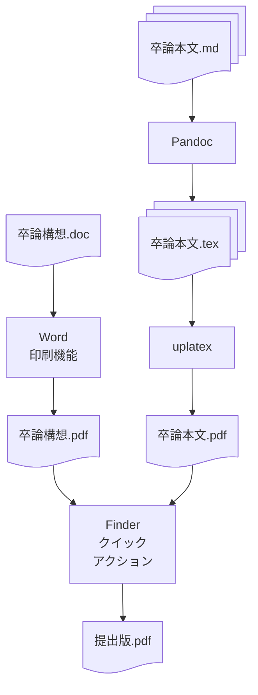

卒論指導申込を一旦提出。
もう少し完成度を上げた原稿を更新して再度申請するつもりですが、とりあえず晴れやかな気持ち。

自分の場合、軽量なPDFを作る環境があるので、単純にくっつけて出しました。
具体的には、MacのWordで卒論構想を書いて(3頁分)、印刷画面からPDFに変換したものと、
卒論本文(現在までの10頁分)を Markdown -> (Pandoc) -> TeX  -> (uplatex/upbibtex/dvipdfmx) -> pdf に変換したものとを、
Finderのクイックアクションで結合しました。
図にするとこんな感じです。

2つ合わせても400kB程度なので、卒論本文が50頁ぐらいまでならサイズ上限2MBに収りそうです。

論文構想はひたすら書いた本文をPDFで貼って送ると良いかもしれない。